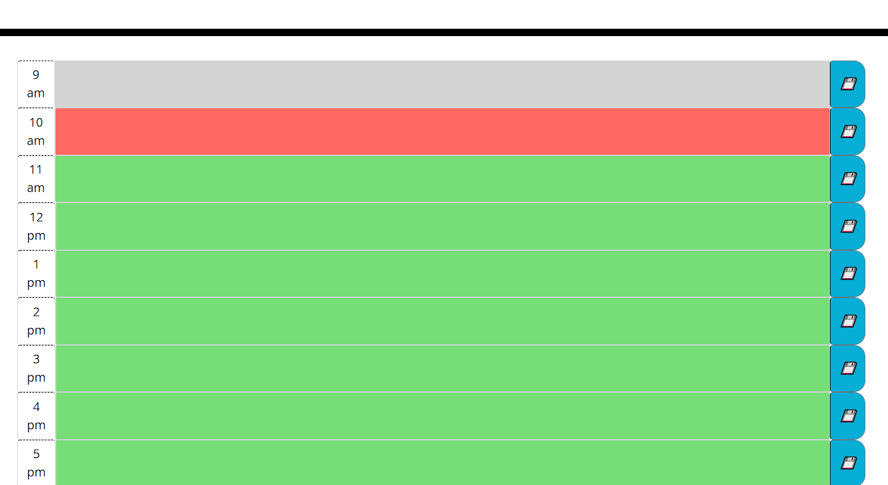

# DayPlanner

## Description

The purpose of this project was to create a simplified day planner for a work day. The user can input and save events, and can easily see past, current, and future events based on intuitive color coding. For even greater utility, the current day and time is set at the top of the page.

## Screenshot of Website

Here's a screen shot showing the color coding based on the time

## Deployed Website

Please visit [github pages for repo](https://segarrison.github.io/DayPlanner/) to see the deployed website.

##Technology

This site was built using:
*Bootstrap
*Jquery
\*Moment.js
